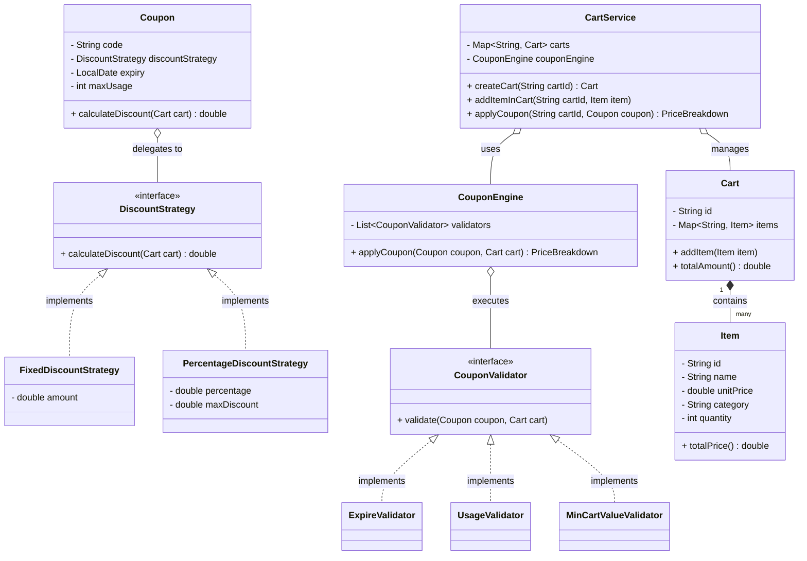

# 🛒 Coupon Application & Cart Management System

A sophisticated Low-Level Design (LLD) implementation for a flexible e-commerce coupon engine. This system demonstrates the power of design patterns in creating a scalable and maintainable codebase.

---

## 🎨 Design Philosophy

This project aims to solve the problem of dynamic coupon application where validation rules and discount calculations change frequently.

- **Why?** To avoid "God Classes" and spaghetti code when adding new discount types (like BOGO) or new validation rules (like Category-specific coupons).
- **How?** By using the **Strategy Pattern** for discounts and a **Validator Pattern** for rules, allowing the system to be "Open for Extension but Closed for Modification."
- **What?** A decoupled architecture where `CartService` coordinates between `Carts`, `Coupons`, and the `CouponEngine`.

---

## 🗺️ Architectural Overview (UML)



---

## 📋 Comprehensive Class Breakdown

### 🛠️ Core Models

#### **`Item`**

- **What**: Represents a single product entry in the shopping cart.
- **Why**: Centralizes product logic (like total price calculation) so that changes to pricing rules don't affect the rest of the system.
- **How**: Stores unit price and quantity; provides `totalPrice()` which is used by the Cart.

#### **`Cart`**

- **What**: A container for multiple `Item` objects.
- **Why**: To aggregate total costs and provide a single object that represents the user's intent to purchase.
- **How**: Uses a `Map<String, Item>` to efficiently manage items and avoid duplicates, merging quantities if the same item is added again.

#### **`Coupon`**

- **What**: A blueprint for a discount offer.
- **Why**: To separate the _identity_ of a coupon (code, expiry) from the _math_ of the discount.
- **How**: Aggregates a `DiscountStrategy`. It asks the strategy to perform the calculation, keeping itself thin.

---

### 🧠 Logic & Orchestration

#### **`DiscountStrategy` (The "How")**

- **What**: An interface defining the contract for discount calculations.
- **Why**: Allows adding new discount types (e.g., Seasonal, Category-based) without changing the `Coupon` class.
- **How**:
  - `FixedDiscountStrategy`: Returns a constant amount, capped at the cart total.
  - `PercentageDiscountStrategy`: Calculates a percentage but ensures it stays under a defined `maxDiscount`.

#### **`CouponValidator` (The "Why or Why Not")**

- **What**: A set of rules that must be satisfied to apply a coupon.
- **Why**: To keep the system robust against fraud and business rule violations (e.g., using expired coupons).
- **How**:
  - `ExpireValidator`: Validates the timeline.
  - `MinCartValueValidator`: Validates spending thresholds.
  - `UsageValidator`: Validates frequency of use.

#### **`CouponEngine`**

- **What**: The central processing unit for all things coupons.
- **Why**: To provide a single, consistent way to apply coupons throughout the application.
- **How**: It runs the "Chain of Validators." If any validator fails (throws an exception), the process stops. Otherwise, it triggers the discount strategy.

#### **`CartService`**

- **What**: The entry point for external consumers.
- **Why**: To hide the complexity of the internal engine and model interactions (Facade Pattern).
- **How**: Manages a registry of active carts and provides a clean method `applyCoupon(cartId, coupon)`.

---

## 🚀 Execution & Testing

The system includes a detailed test suite in `Main.java` which verifies:
✅ **Success Cases**: Percentage and Fixed discounts with various cart values.
❌ **Failure Cases**: Expired coupons, usage limits, and minimum cart value requirements.

**To run the system:**

```bash
javac -d bin src/**/*.java
java -cp bin Main
```
